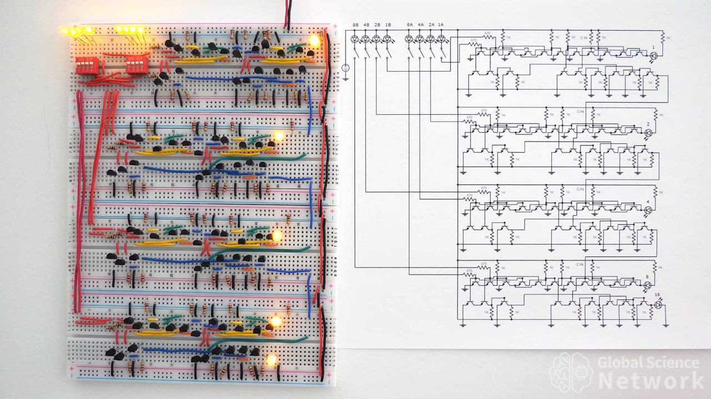
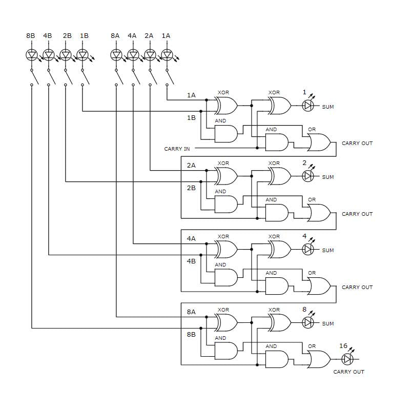
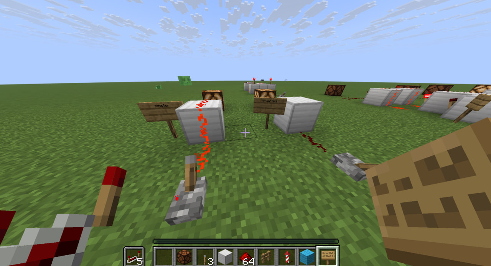
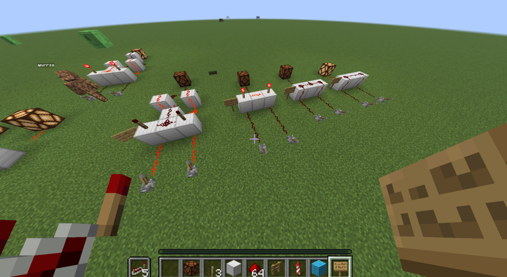
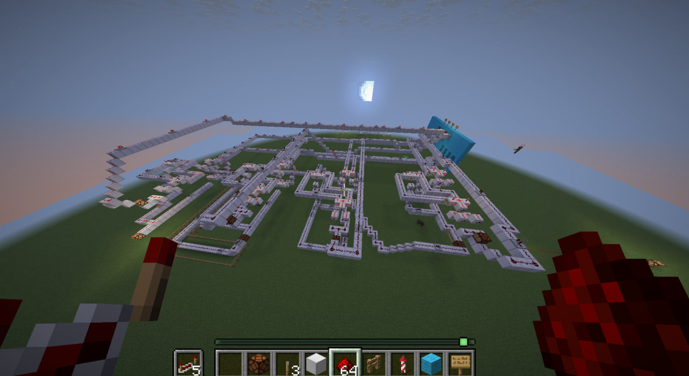

# Creating a 4 bit calculator in Minecraft:
### requirements : Minecraft + Logic gates+ shematics based on logic gates
you can find how to make [logic gates](https://www.minecraft101.net/redstone/redstone-logic.html) in minecraft.
After doing that you can build any projects based on logic gates

### And we are going to do this one:

Dont panic bro.
There's a simplified version too

so we use :

Lever as Switches 

RedStone as Wires

Nothing as Carry in 

Lamps as LED's

### **Important**: Build every thing in the air because it's easier to connect every thing there

# First things first:
make all logic gates in mc

then we build the shematics

> it's my first redstone soooooooo its a total mess

and It's DONE
you can build wahtever you want based on logic gates in mc
